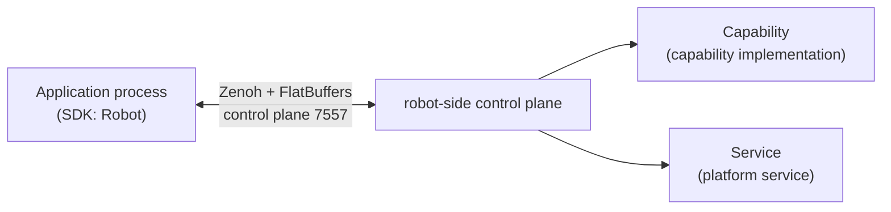

# Overview & Architecture

The fabot SDK is a Python client development kit for integrators (wheel name `fabot-sdk`, import name `fabot`), used to connect to, control, and monitor a fabot robot from the application side. This page covers where the SDK fits in the system, core concepts, and the API layers; installation and version compatibility are in [Installation & Configuration](install/index.md).

## Where the SDK Fits in the System

The SDK is embedded in your application process and communicates with the Manager process on the robot over Zenoh native + FlatBuffers. The SDK does not link against ROS (`rclcpp` / `rclpy`) and can run on any host that satisfies its dependencies (see [Requirements](install/requirements.md)).



A Capability is a domain-functional unit on the robot (chassis, arm, camera, and so on), pluggably installed in a Slot; the SDK exposes a strongly typed Proxy per slot. Services are resident processes on the robot side; the SDK can perform limited lifecycle and configuration operations on them via `robot.services` — see [Service Management](usage/services.md).

## A Quick Taste

```python
from fabot import Robot

with Robot.connect("192.168.1.10", 7557) as robot:
    robot.wait_ready()                                        # wait for bound, required slots to become ready
    print(robot.state().state)                                # robot-wide state snapshot
    robot.chassis.set_velocity(vx=0.2, vy=0.0, vtheta=0.0)   # chassis velocity command
```

`Robot.connect(ip, port, options=None)` establishes the connection and returns a `Robot`; `from_config` / `from_endpoint` / `from_backend` and the offline `Robot.mock()` are also available — see [Connection & Lifecycle](usage/connection.md).

## Capabilities, Slots, and Proxies

The SDK ships typed proxies for 15 capability modules, accessed through the 22 slot properties on `Robot` (`robot.<slot>`). The same capability can be installed in multiple slots (e.g. left and right arms); each slot is an independent instance of the same API.

| Module | Slot properties | Description |
|--------|-----------------|-------------|
| Body `body` | `robot.body` | Torso joint motion, waist lift / rotation → [body](reference/python/body.md) |
| Arm `arm` | `robot.left_arm` / `robot.right_arm` | Single-arm joint motion and end-effector pose control → [arm](reference/python/arm.md) |
| Dual arm `arms` | `robot.arms` | Coordinated dual-arm motion, impedance dragging, relative pose holding → [arms](reference/python/arms.md) |
| Hand `hand` | `robot.left_hand` / `robot.right_hand` | Multi-finger joint aperture control → [hand](reference/python/hand.md) |
| Gripper `gripper` | `robot.left_gripper` / `robot.right_gripper` | Gripper aperture with speed / torque control → [gripper](reference/python/gripper.md) |
| Head `head` | `robot.head` | Head pitch / yaw motion control → [head](reference/python/head.md) |
| Chassis `chassis` | `robot.chassis` | Velocity commands, station navigation, relative moves, relocalization → [chassis](reference/python/chassis.md) |
| Motion `motion` | `robot.motion` | Whole-body motion planning and FSM control, estop and reset → [motion](reference/python/motion.md) |
| Power `power` | `robot.power_1` / `robot.power_2` | Energy, voltage, current, temperature, and charging state monitoring → [power](reference/python/power.md) |
| IO `io` | `robot.io` | Digital / analog IO read-write and level-change streams → [io](reference/python/io.md) |
| Camera `camera` | `robot.head_camera` / `robot.chest_camera` / `robot.left_wrist_camera` / `robot.right_wrist_camera` | Single-frame capture, stream configuration, image frame channels → [camera](reference/python/camera.md) |
| Screen `screen` | `robot.screen` | Face-screen text / image / video display control → [screen](reference/python/screen.md) |
| Light `light` | `robot.light` | Light-strip mode, color, brightness, animation period → [light](reference/python/light.md) |
| Voice `voice` | `robot.voice` | Wake-up / transcription / intent recognition and speech synthesis → [voice](reference/python/voice.md) |
| Teleop `teleop` | `robot.teleop` | Establishing and stopping remote teleoperation sessions → [teleop](reference/python/teleop.md) |

Every capability proxy also shares a common set of members: `slot_id`, `has_adapter`, `as_adapter(...)`, `events`, `health()`, `lifecycle()`, `faults()` — see [Capability API Overview](reference/python/index.md).

## Robot-Wide Entry Points

Beyond the slot properties, `Robot` provides a set of robot-wide entry points:

| Entry | Description |
|-------|-------------|
| `robot.estop` | Software estop: `engage()` / `release()` / `state()`; recovery after an estop is covered in [Troubleshooting](troubleshooting.md) |
| `robot.events` | Robot-wide event subscriptions: `estop_changed` / `robot_state_changed` / `registry_changed` / `config_changed` / `service_state_changed` / `faults_changed`, plus the wildcard `subscribe()` — see [Events & Data Channels](usage/events-channels.md) |
| `robot.logs` | Robot log subscription (`subscribe(callback, min_level=..., slot=...)`) |
| `robot.services` | Start / stop / restart / configure / query platform services — see [Service Management](usage/services.md) |
| `robot.configuration` | Read and apply robot configuration (`get()` / `apply()`) — see [Configuration Management](usage/configuration.md) |
| `robot.connection` | Connection state query and subscription (`is_connected()` / `subscribe()`) — see [Connection & Lifecycle](usage/connection.md) |
| `robot.state()` | Robot-wide state snapshot `RobotState` (`state` / `reasons` / `revision`, etc.) — see [Status, Faults & Lifecycle](usage/status-faults.md) |
| `robot.status()` | Aggregated status bag `RobotStatus` (power, screen, voice) |
| `robot.faults()` | Per-slot aggregated fault snapshot `RobotFaults` |
| `robot.wait_ready()` | Wait for bound, enabled-as-required slots to become ready; `close()` / `with` release the connection |

## Core Terminology

| Term | Meaning |
|------|---------|
| Capability | A callable domain-functional unit (e.g. IO, chassis, arm) |
| Command | A synchronous request-response call |
| Operation | A long-running, cancelable task (e.g. navigation) |
| Channel | A data stream actively pushed by the server (e.g. IO level changes) |
| Event | A single message delivered by the subscription mechanism |
| Slot | A pluggable capability installation position on the robot (e.g. `left_arm`, `head_camera`) |
| Robot Facade | The unified application-facing entry point `Robot` |
| QoS | Channel quality-of-service profile: `"latest"` / `"realtime"` / `"reliable"` (a string, passed via `qos_profile` when opening a channel) |
| Status bag | Aggregated capability status snapshot, GET-only, not subscribable |

## Two API Layers of the Client

| Layer | API | Notes |
|-------|-----|-------|
| Product layer | `fabot.Robot` and capability proxies | Strongly typed, organized by slot — **use this layer day to day** |
| Core layer | `fabot.core.SystemClient` / `SlotHandle` | Transport-level API with raw byte payloads, for advanced use and SDK internals |

## Sync and Async

Synchronous API by default; `fabot.core.asyncio_client` provides an asyncio mirror (`SystemClient` / `SlotHandle` / `OperationHandle`).

:::warning Do not call blocking APIs from the SDK's I/O thread
Calling synchronous interfaces from SDK-internal threads such as event callbacks raises an error (Python raises `ClientThreadError`). Keep callbacks lightweight and move blocking calls to your own thread.
:::

## Error Model

Protocol errors raised by the SDK are uniformly subclasses of `FabotError`, carrying `code` / `category` / `retryable` / `trace_id`; they are subdivided by category into `Timeout` / `NotFound` / `InvalidArgument` / `ResourceConflict`, and so on, plus the configuration- and adapter-related `ConfigurationConflict` / `AdapterMismatch` / `AdapterUnbound`. See [Error Handling](usage/errors.md) for the full hierarchy and handling advice.

## Next Steps

- [Installation & Configuration](install/index.md): requirements, installing the Python SDK, version compatibility
- [Python Tutorial](tutorials/python.md): get your first Python program running
- [Common Operations](usage/index.md): connection, commands & operations, events & channels, status & faults, configuration, errors, mock
- [Python API Reference](reference/python/index.md): the Robot entry point and the full interface of all 15 capability modules
