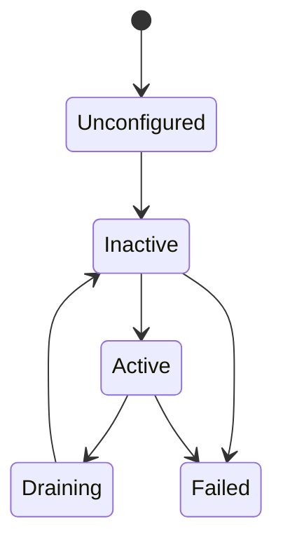

# Status, Faults & Lifecycle

The SDK exposes runtime information on three levels: **whole-robot aggregated status** (`robot.state()` / `status()` / `faults()`), **capability status bags** (only power / screen / voice have `status()`), and **lifecycle & health** (`lifecycle()` / `health()` per slot). All of them are **GET-only** active queries with no subscription API; changes are pushed via events — see [Events & Data Channels](events-channels.md).

## Whole-Robot Aggregated Status

`Robot` provides whole-robot snapshots:

| Method | Returns | Notes |
|--------|---------|-------|
| `state()` | `RobotState` | Whole-robot run-state snapshot; the `.state` field is a `RobotRunState` |
| `status()` | `RobotStatus` | Aggregates the `power_1` / `power_2` / `screen` / `voice` status bags + `generation` / `revision` (configuration generation) |
| `faults()` | `RobotFaults` | Aggregates the current fault bags of all 22 slots |
| `version()` | `str` | Robot platform version |
| `sdk_version` | `str` | The SDK's own version (a property, not a method) |

`state()` returns a `RobotState` snapshot, not a bare enum:

| Field | Type | Notes |
|-------|------|-------|
| `state` | `RobotRunState` | `Unknown` / `Idle` / `Running` / `Degraded` / `Fault` / `Estopped` |
| `reasons` | `list[str]` | Reasons for entering the current state |
| `revision` | `int` | State revision |
| `source_instance_id` | `str` | Source instance id |

Convenience properties: `is_running` / `is_idle` / `is_degraded` / `is_fault` / `is_estopped`. Whole-robot state changes are pushed via `robot.events.robot_state_changed`; after an e-stop the robot enters `Estopped` — see [Troubleshooting](../troubleshooting.md) for the recovery procedure.

```python
st = robot.state()
if st.is_estopped:
    print(st.reasons)

agg = robot.status()
print(agg.generation, agg.power_1.energy, agg.screen.activity)

print(robot.version(), robot.sdk_version)
```

## Capability Status Bag (Status)

Currently only **power / screen / voice** provide a `status() -> Status` method:

| Capability | Status fields | Reference |
|-----------|---------------|-----------|
| `robot.power_1` / `robot.power_2` | `energy` / `current` / `voltage` / `temperature` / `is_charging` | [Power](../reference/python/power.md) |
| `robot.screen` | `activity`: `Activity.Idle` / `Image` / `Video` (StrEnum) | [Screen](../reference/python/screen.md) |
| `robot.voice` | `activity`: `Activity.Idle` / `Listening` / `Speaking` (StrEnum) | [Voice](../reference/python/voice.md) |

Other modules have no `status()` and do not participate in the `robot.status()` aggregation (the corresponding fields keep their default values). The status bag is GET-only: there is no `subscribe_status`; to track changes, subscribe to the capability's event streams.

```python
st = robot.power_1.status()
print(st.energy, st.voltage, st.is_charging)

act = robot.screen.status().activity
if act == "idle":   # Activity is a StrEnum and compares directly with strings
    ...
```

## Faults

- Whole-robot aggregate query `robot.faults() -> RobotFaults`: a `revision` plus one typed fault-bag field per slot (e.g. `faults.chassis`, `faults.left_arm`); for a single capability use `robot.<slot>.faults()`.
- A named fault appears as a `FaultState` field in the bag: `active` / `catalog_id` / `fault_class` (`CapabilityStateClass`: `Nominal` / `Degraded` / `Fault`) / `first_seen_us` / `last_seen_us` / `count`. **No module currently declares named faults**, so each bag contains only `revision`.
- Fault **changes** are pushed via events: `robot.events.faults_changed` (whole robot, carrying `RobotFaults`) / `robot.<slot>.events.fault_changed` (single capability).
- A fault's `catalog_id` can be localized for display with `Catalogs`; see [Localized Text (Catalogs)](catalogs.md).

```python
def on_faults(event):
    print(event.header.slot_id, event.faults.revision)

token = robot.events.faults_changed.subscribe(on_faults)
```

## Lifecycle & Health

Each slot has two read-only queries:

- `robot.<slot>.lifecycle() -> CapabilityLifecycleSnapshot`: lifecycle stage (`lifecycle`), health (`health`), and source instance (`source_instance_id`).
- `robot.<slot>.health() -> SlotHealth`: the product-level "usable right now" view, with fields `is_usable` / `lifecycle` / `health` / `standing_faults` (number of standing faults).

These methods raise `AdapterUnbound` when the slot has no adapter bound; check `has_adapter` first (see [Robot Entry](../reference/python/robot.md)).

`LifecycleState` (IntEnum):

| Value | Meaning |
|-------|---------|
| `Unknown` | State unknown (not projected from the descriptor) |
| `Unconfigured` | Loaded but not configured |
| `Inactive` | Configured, not activated |
| `Active` | Running normally |
| `Draining` | Draining (no new tasks accepted) |
| `Failed` | Failed |

`HealthState` (IntEnum): `Unknown` / `Healthy` / `Unhealthy` / `Draining`.



Transitions are driven by the platform according to the adapter's actual runtime; the diagram shows the typical path. Trust the values returned by `lifecycle()` and pushed by `lifecycle_changed` events. Lifecycle or health changes are pushed via `robot.<slot>.events.lifecycle_changed` (payload is a `CapabilityLifecycleSnapshot`):

```python
def on_lifecycle(event):
    snap = event.lifecycle
    print(event.header.slot_id, snap.lifecycle.name, snap.health.name)

token = robot.left_arm.events.lifecycle_changed.subscribe(on_lifecycle)
```
