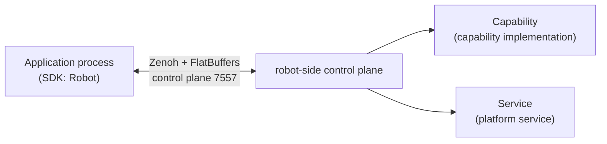

# Overview & Architecture

## Where the SDK Fits in the System

The SDK is embedded in your application process and communicates with the Manager process on the robot over Zenoh native + FlatBuffers. The SDK does not link against ROS (`rclcpp` / `rclpy`) and can run on any host that satisfies its dependencies.

## Core Terminology

| Term | Meaning |
|------|---------|
| Capability | A callable domain-functional unit (e.g. IO, chassis, arm) |
| Command | A synchronous request-response call |
| Operation | A long-running, cancelable task (e.g. navigation) |
| Channel | A data stream actively pushed by the server (e.g. IO level changes) |
| Event | A single message delivered by the subscription mechanism |
| Slot | A pluggable capability installation position on the robot (e.g. `left_arm`, `head_camera`) |
| Robot Facade | The unified application-facing entry point `Robot` |
| QoS | Channel quality of service: `Realtime` / `Latest` / `Reliable` |
| Status bag | Aggregated capability status snapshot, GET-only, not subscribable |

## Two API Layers of the Client

| Layer | API | Notes |
|-------|-----|-------|
| Product layer | `fabot.Robot` and capability proxies | Strongly typed, organized by slot — **use this layer day to day** |
| Core layer | `fabot.core.SystemClient` / `SlotHandle` | Transport-level API with raw byte payloads, for advanced use and SDK internals |

## Sync and Async

Synchronous API by default; `fabot.core.asyncio_client` provides an asyncio mirror (`SystemClient` / `SlotHandle` / `OperationHandle`).

!!! warning "Do not call blocking APIs from the SDK's I/O thread"
    Calling synchronous interfaces from SDK-internal threads such as event callbacks raises an error (Python raises `ClientThreadError`). Keep callbacks lightweight and move blocking calls to your own thread.
