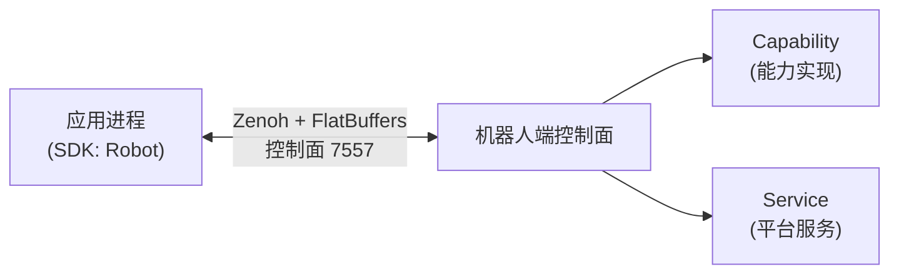

# 概述与架构

## SDK 在系统中的位置

SDK 嵌入你的应用进程，通过 Zenoh native + FlatBuffers 与机器人上的 Manager 进程通信。SDK 不链接 ROS（`rclcpp` / `rclpy`），可以运行在任意满足依赖的主机上。

## 核心术语

| 术语 | 含义 |
|------|------|
| Capability | 能力，一个可被调用的领域功能单元（如 IO、底盘、机械臂） |
| Command | 命令，一次同步请求-响应的调用 |
| Operation | 操作，长时运行的可取消任务（如导航） |
| Channel | 通道，服务端主动推送的数据流（如 IO 电平变化） |
| Event | 事件，订阅机制投递的单条消息 |
| Slot | 槽位，机器人上的可插拔能力安装位（如 `left_arm`、`head_camera`） |
| Robot Facade | 面向应用的统一入口 `Robot` |
| QoS | 通道服务质量：`Realtime` / `Latest` / `Reliable` |
| 状态袋（status bag） | 能力聚合状态快照，GET-only，不可订阅 |

## 客户端两层 API

| 层 | API | 说明 |
|----|-----|------|
| 产品层 | `fabot.Robot` 及能力 Proxy | 强类型、按槽位组织，**日常使用这一层** |
| 核心层 | `fabot.core.SystemClient` / `SlotHandle` | 传输级 API，原始字节 payload，供高级用法与 SDK 内部使用 |

## 同步与异步

默认同步 API；`fabot.core.asyncio_client` 提供 asyncio 镜像（`SystemClient` / `SlotHandle` / `OperationHandle`）。

!!! warning "不要在 SDK 的 I/O 线程里调用阻塞 API"
    在事件回调等 SDK 内部线程中调用同步接口会抛错（Python 抛 `ClientThreadError`）。在回调里只做轻量处理，把阻塞调用放到自己的线程。
