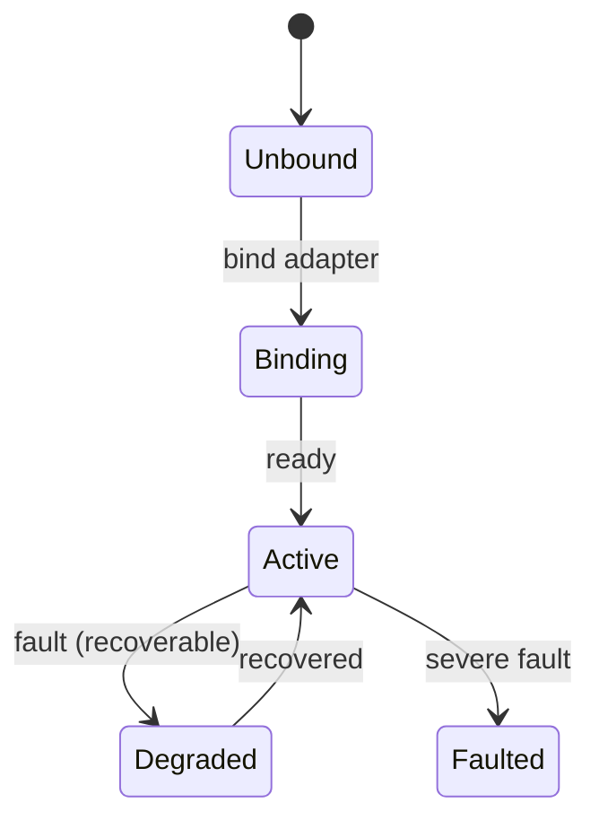

# Status, Faults & Lifecycle

## Whole-Robot Aggregated Status

`Robot` provides whole-robot snapshots (all GET-only, actively queried; changes are notified via [events](events-channels.md)):

| Method | Returns | Notes |
|--------|---------|-------|
| `state()` | `RobotRunState` | Whole-robot run state |
| `status()` | `RobotStatus` | Aggregates all capability status bags + `generation` / `revision` (configuration generation) |
| `faults()` | `RobotFaults` | Aggregates current faults of all slots |
| `version()` | `str` | Platform version; `sdk_version` is the SDK's own version |

## Capability Status Bag (Status)

Currently **power / screen / voice** provide a `status() -> Status` method. Other modules have no `status()`; for whole-robot status see `robot.status()`. The status bag is **GET-only**: there is no `subscribe_status`; to track changes, subscribe to the capability's `status_changed`-style events (if the module provides them).

```python
st = robot.screen.status()
print(st.activity)   # Activity.IDLE / IMAGE / VIDEO
```

## Faults

- `robot.faults()` queries the aggregate; for a single capability use `robot.<slot>.faults()`.
- Fault **changes** are pushed via events: `robot.events.faults_changed` (whole robot) / `robot.<slot>.events.fault_changed` (single capability).
- Each fault carries an error code (platform 8xxxx / capability-private 9xxxx, globally unique), which can be localized for display with `Catalogs`; see [Error Handling](errors.md).

## Lifecycle & Health

- `robot.<slot>.lifecycle() -> CapabilityLifecycleSnapshot`: the capability's current lifecycle stage (`LifecycleState`).
- `robot.<slot>.health() -> SlotHealth`: health state (`HealthState`).
- Change event: `robot.<slot>.events.lifecycle_changed`.



!!! todo
    The exact state set and transition conditions of the lifecycle state machine are governed by the `LifecycleState` enum and the platform docs; the diagram in this section is illustrative.
