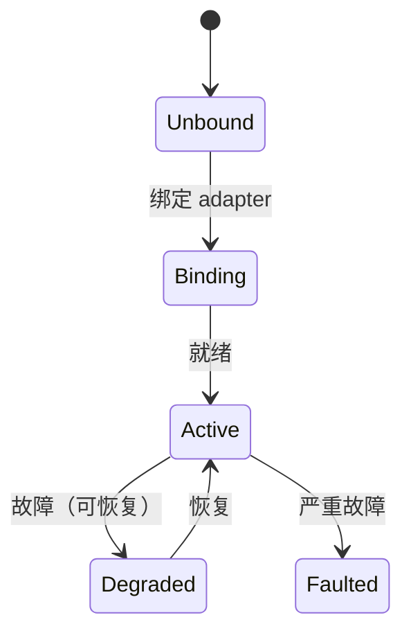

# 状态、故障与生命周期

## 整机聚合状态

`Robot` 提供整机级快照（均为 GET-only，主动查询；变化通过[事件](events-channels.md)通知）：

| 方法 | 返回 | 说明 |
|------|------|------|
| `state()` | `RobotRunState` | 整机运行状态 |
| `status()` | `RobotStatus` | 聚合各能力状态袋 + `generation` / `revision`（配置代际） |
| `faults()` | `RobotFaults` | 聚合全部槽位当前故障 |
| `version()` | `str` | 平台版本；`sdk_version` 为 SDK 自身版本 |

## 能力状态袋（Status）

当前 **power / screen / voice** 提供 `status() -> Status` 方法。其他模块没有 `status()`；整机状态见 `robot.status()`。状态袋是 **GET-only**：没有 `subscribe_status`，跟踪变化请订阅该能力的 `status_changed` 类事件（若该模块提供）。

```python
st = robot.screen.status()
print(st.activity)   # Activity.IDLE / IMAGE / VIDEO
```

## 故障（Fault）

- `robot.faults()` 聚合查询；单能力用 `robot.<slot>.faults()`。
- 故障**变化**通过事件推送：`robot.events.faults_changed`（整机）/ `robot.<slot>.events.fault_changed`（单能力）。
- 每条故障含错误码（平台 8xxxx / 能力 9xxxx，全局唯一），可用 `Catalogs` 本地化展示，见 [错误处理](errors.md)。

## 生命周期与健康度

- `robot.<slot>.lifecycle() -> CapabilityLifecycleSnapshot`：能力当前生命周期阶段（`LifecycleState`）。
- `robot.<slot>.health() -> SlotHealth`：健康状态（`HealthState`）。
- 变化事件：`robot.<slot>.events.lifecycle_changed`。



!!! todo
    生命周期状态机的精确状态集与迁移条件以 `LifecycleState` 枚举和平台文档为准，本节图示为示意。
