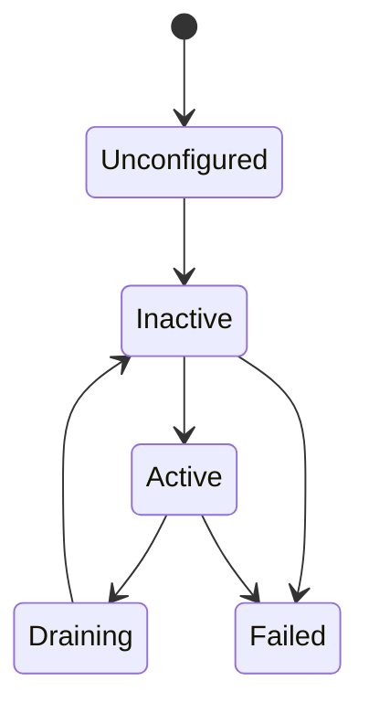

# 状态、故障与生命周期

SDK 把机器人运行时信息分三层暴露：**整机聚合状态**（`robot.state()` / `status()` / `faults()`）、**能力状态袋**（仅 power / screen / voice 有 `status()`）、**生命周期与健康度**（每个槽位的 `lifecycle()` / `health()`）。三者都是 **GET-only** 的主动查询，没有订阅接口；变化通过事件推送，见 [事件与数据通道](events-channels.md)。

## 整机聚合状态

`Robot` 提供整机级快照：

| 方法 | 返回 | 说明 |
|------|------|------|
| `state()` | `RobotState` | 整机运行状态快照，`.state` 字段是 `RobotRunState` |
| `status()` | `RobotStatus` | 聚合 `power_1` / `power_2` / `screen` / `voice` 四个状态袋 + `generation` / `revision`（配置代际） |
| `faults()` | `RobotFaults` | 聚合全部 22 个槽位的当前故障袋 |
| `version()` | `str` | 机器人平台版本 |
| `sdk_version` | `str` | SDK 自身版本（属性，非方法） |

`state()` 返回的是 `RobotState` 快照，不是裸枚举：

| 字段 | 类型 | 说明 |
|------|------|------|
| `state` | `RobotRunState` | `Unknown` / `Idle` / `Running` / `Degraded` / `Fault` / `Estopped` |
| `reasons` | `list[str]` | 进入当前状态的原因 |
| `revision` | `int` | 状态修订号 |
| `source_instance_id` | `str` | 来源实例 id |

另有便捷属性 `is_running` / `is_idle` / `is_degraded` / `is_fault` / `is_estopped`。整机状态变化通过 `robot.events.robot_state_changed` 推送；急停触发后整机进入 `Estopped`，恢复流程见 [故障排除](../troubleshooting.md)。

```python
st = robot.state()
if st.is_estopped:
    print(st.reasons)

agg = robot.status()
print(agg.generation, agg.power_1.energy, agg.screen.activity)

print(robot.version(), robot.sdk_version)
```

## 能力状态袋（Status）

当前只有 **power / screen / voice** 三个能力提供 `status() -> Status`：

| 能力 | 状态袋字段 | 参考 |
|------|-----------|------|
| `robot.power_1` / `robot.power_2` | `energy` / `current` / `voltage` / `temperature` / `is_charging` | [电源 Power](../reference/python/power.md) |
| `robot.screen` | `activity`：`Activity.Idle` / `Image` / `Video`（StrEnum） | [面屏 Screen](../reference/python/screen.md) |
| `robot.voice` | `activity`：`Activity.Idle` / `Listening` / `Speaking`（StrEnum） | [语音 Voice](../reference/python/voice.md) |

其他模块没有 `status()`，也不参与 `robot.status()` 聚合（对应字段保持默认值）。状态袋是 GET-only：没有 `subscribe_status`，跟踪变化请订阅该能力的事件流。

```python
st = robot.power_1.status()
print(st.energy, st.voltage, st.is_charging)

act = robot.screen.status().activity
if act == "idle":   # Activity 是 StrEnum，可直接与字符串比较
    ...
```

## 故障（Fault）

- 整机聚合查询 `robot.faults() -> RobotFaults`：`revision` 加上每个槽位一个类型化故障袋字段（如 `faults.chassis`、`faults.left_arm`）；单能力用 `robot.<slot>.faults()`。
- 已命名故障在故障袋中是 `FaultState` 字段：`active` / `catalog_id` / `fault_class`（`CapabilityStateClass`：`Nominal` / `Degraded` / `Fault`）/ `first_seen_us` / `last_seen_us` / `count`。**当前所有模块均未声明已命名故障**，故障袋只含 `revision`。
- 故障**变化**通过事件推送：`robot.events.faults_changed`（整机，携带 `RobotFaults`）/ `robot.<slot>.events.fault_changed`（单能力）。
- 故障的 `catalog_id` 可用 `Catalogs` 本地化展示，见 [错误处理](errors.md)。

```python
def on_faults(event):
    print(event.header.slot_id, event.faults.revision)

token = robot.events.faults_changed.subscribe(on_faults)
```

## 生命周期与健康度

每个槽位有两个只读查询：

- `robot.<slot>.lifecycle() -> CapabilityLifecycleSnapshot`：生命周期阶段（`lifecycle`）、健康度（`health`）与来源实例（`source_instance_id`）。
- `robot.<slot>.health() -> SlotHealth`：产品层「当前是否可用」视图，字段为 `is_usable` / `lifecycle` / `health` / `standing_faults`（站立故障数）。

槽位未绑定 adapter 时这些方法会抛 `AdapterUnbound`，可先用 `has_adapter` 判断（见 [Robot 入口](../reference/python/robot.md)）。

`LifecycleState`（IntEnum）：

| 值 | 含义 |
|----|------|
| `Unknown` | 状态未知（未投影到描述符） |
| `Unconfigured` | 已加载但未配置 |
| `Inactive` | 已配置，未激活 |
| `Active` | 正常运行 |
| `Draining` | 正在排空（停止接收新任务） |
| `Failed` | 失败 |

`HealthState`（IntEnum）：`Unknown` / `Healthy` / `Unhealthy` / `Draining`。



状态迁移由平台按适配器实际运行情况驱动，上图为典型路径；以 `lifecycle()` 返回值与 `lifecycle_changed` 事件的实际值为准。生命周期或健康度变化时推送 `robot.<slot>.events.lifecycle_changed`（payload 为 `CapabilityLifecycleSnapshot`）：

```python
def on_lifecycle(event):
    snap = event.lifecycle
    print(event.header.slot_id, snap.lifecycle.name, snap.health.name)

token = robot.left_arm.events.lifecycle_changed.subscribe(on_lifecycle)
```
