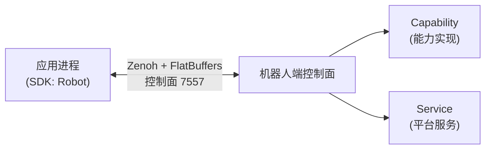

# 概述与架构

fabot SDK 是面向集成开发者的 Python 客户端开发包（wheel 名 `fabot-sdk`，import 名 `fabot`），用于在应用侧连接、控制并监控一台 fabot 机器人。本页介绍 SDK 在系统中的位置、核心概念与 API 分层；安装与版本配套见 [安装与配置](install/index.md)。

## SDK 在系统中的位置

SDK 嵌入你的应用进程，通过 Zenoh native + FlatBuffers 与机器人上的 Manager 进程通信。SDK 不链接 ROS（`rclcpp` / `rclpy`），可以运行在任意满足依赖的主机上（环境要求见 [环境要求](install/requirements.md)）。



能力（Capability）是机器人上的领域功能单元（底盘、机械臂、相机等），以可插拔的方式安装在槽位（Slot）上；SDK 侧为每个槽位提供强类型 Proxy。平台服务（Service）是机器人侧的常驻进程，SDK 可经 `robot.services` 做有限的生命周期与配置操作，见 [服务管理](usage/services.md)。

## 快速一瞥

```python
from fabot import Robot

with Robot.connect("192.168.1.10", 7557) as robot:
    robot.wait_ready()                                        # 等待已绑定且必需的槽位就绪
    print(robot.state().state)                                # 整机运行状态快照
    robot.chassis.set_velocity(vx=0.2, vy=0.0, vtheta=0.0)   # 底盘速度指令
```

`Robot.connect(ip, port, options=None)` 建立连接并返回 `Robot`；也支持 `from_config` / `from_endpoint` / `from_backend` 与离线调试用的 `Robot.mock()`，详见 [连接与生命周期](usage/connection.md)。

## 能力、槽位与 Proxy

SDK 内置 15 个能力模块的类型化 Proxy，经 `Robot` 的 22 个槽位属性访问（`robot.<slot>`）。同一能力可安装在多个槽位（如左右臂），各槽位是同一套 API、彼此独立的实例。

| 模块 | 槽位属性 | 说明 |
|------|----------|------|
| 躯干 `body` | `robot.body` | 躯干关节运动与腰部升降 / 旋转控制 → [body](reference/python/body.md) |
| 机械臂 `arm` | `robot.left_arm` / `robot.right_arm` | 单臂关节运动与末端位姿控制 → [arm](reference/python/arm.md) |
| 双臂 `arms` | `robot.arms` | 双臂协同运动、阻抗拖拽与相对位姿保持 → [arms](reference/python/arms.md) |
| 灵巧手 `hand` | `robot.left_hand` / `robot.right_hand` | 多指关节开合度控制 → [hand](reference/python/hand.md) |
| 夹爪 `gripper` | `robot.left_gripper` / `robot.right_gripper` | 夹爪开合度与速度 / 力矩控制 → [gripper](reference/python/gripper.md) |
| 头部 `head` | `robot.head` | 头部俯仰 / 偏航运动控制 → [head](reference/python/head.md) |
| 底盘 `chassis` | `robot.chassis` | 速度指令、站点导航、相对移动与重定位 → [chassis](reference/python/chassis.md) |
| 运动 `motion` | `robot.motion` | 全身运动规划与运控状态机、急停与复位 → [motion](reference/python/motion.md) |
| 电源 `power` | `robot.power_1` / `robot.power_2` | 电量、电压、电流、温度与充电状态监控 → [power](reference/python/power.md) |
| IO `io` | `robot.io` | 数字 / 模拟 IO 读写与电平变化流 → [io](reference/python/io.md) |
| 相机 `camera` | `robot.head_camera` / `robot.chest_camera` / `robot.left_wrist_camera` / `robot.right_wrist_camera` | 单帧抓取、开流配置与图像帧通道 → [camera](reference/python/camera.md) |
| 面屏 `screen` | `robot.screen` | 面屏文本 / 图片 / 视频显示控制 → [screen](reference/python/screen.md) |
| 灯效 `light` | `robot.light` | 灯带模式、颜色、亮度与动画周期 → [light](reference/python/light.md) |
| 语音 `voice` | `robot.voice` | 语音唤醒 / 转写 / 意图识别与合成播报 → [voice](reference/python/voice.md) |
| 遥操作 `teleop` | `robot.teleop` | 远程遥操作会话的建立与停止 → [teleop](reference/python/teleop.md) |

每个能力 Proxy 还有一组公共成员：`slot_id`、`has_adapter`、`as_adapter(...)`、`events`、`health()`、`lifecycle()`、`faults()`，见 [能力接口概述](reference/python/index.md)。

## 整机级入口

`Robot` 除槽位属性外，还提供一组整机级入口：

| 入口 | 说明 |
|------|------|
| `robot.estop` | 软件急停：`engage()` / `release()` / `state()`；急停后的恢复见 [故障排除](troubleshooting.md) |
| `robot.events` | 整机事件订阅：`estop_changed` / `robot_state_changed` / `registry_changed` / `config_changed` / `service_state_changed` / `faults_changed`，以及通配 `subscribe()`，见 [事件与数据通道](usage/events-channels.md) |
| `robot.logs` | 机器人日志订阅（`subscribe(callback, min_level=..., slot=...)`） |
| `robot.services` | 平台服务的启动 / 停止 / 重启 / 配置 / 状态查询，见 [服务管理](usage/services.md) |
| `robot.configuration` | 机器人配置的读取与下发（`get()` / `apply()`），见 [配置管理](usage/configuration.md) |
| `robot.connection` | 连接状态查询与订阅（`is_connected()` / `subscribe()`），见 [连接与生命周期](usage/connection.md) |
| `robot.state()` | 整机状态快照 `RobotState`（`state` / `reasons` / `revision` 等），见 [状态、故障与生命周期](usage/status-faults.md) |
| `robot.status()` | 整机聚合状态袋 `RobotStatus`（电源、面屏、语音） |
| `robot.faults()` | 按槽位聚合的故障快照 `RobotFaults` |
| `robot.wait_ready()` | 等待已绑定且启用为必需的槽位就绪；`close()` / `with` 释放连接 |

## 核心术语

| 术语 | 含义 |
|------|------|
| Capability | 能力，一个可被调用的领域功能单元（如 IO、底盘、机械臂） |
| Command | 命令，一次同步请求-响应的调用 |
| Operation | 操作，长时运行的可取消任务（如导航） |
| Channel | 通道，服务端主动推送的数据流（如 IO 电平变化） |
| Event | 事件，订阅机制投递的单条消息 |
| Slot | 槽位，机器人上的可插拔能力安装位（如 `left_arm`、`head_camera`） |
| Robot Facade | 面向应用的统一入口 `Robot` |
| QoS | 通道服务质量档位：`"latest"` / `"realtime"` / `"reliable"`（字符串，打开通道时经 `qos_profile` 指定） |
| 状态袋（status bag） | 能力聚合状态快照，GET-only，不可订阅 |

## 客户端两层 API

| 层 | API | 说明 |
|----|-----|------|
| 产品层 | `fabot.Robot` 及能力 Proxy | 强类型、按槽位组织，**日常使用这一层** |
| 核心层 | `fabot.core.SystemClient` / `SlotHandle` | 传输级 API，原始字节 payload，供高级用法与 SDK 内部使用 |

## 同步与异步

默认同步 API；`fabot.core.asyncio_client` 提供 asyncio 镜像（`SystemClient` / `SlotHandle` / `OperationHandle`）。

:::warning 不要在 SDK 的 I/O 线程里调用阻塞 API
在事件回调等 SDK 内部线程中调用同步接口会抛错（Python 抛 `ClientThreadError`）。在回调里只做轻量处理，把阻塞调用放到自己的线程。
:::

## 错误模型

SDK 抛出的协议错误统一是 `FabotError` 的子类，携带 `code` / `category` / `retryable` / `trace_id`；按类别细分为 `Timeout` / `NotFound` / `InvalidArgument` / `ResourceConflict` 等，另有配置与适配相关的 `ConfigurationConflict` / `AdapterMismatch` / `AdapterUnbound`。完整层次与处理建议见 [错误处理](usage/errors.md)。

## 下一步

- [安装与配置](install/index.md)：环境要求、安装 Python SDK、版本配套
- [入门教程](tutorials/python.md)：跑通第一个 Python 程序
- [常规操作](usage/index.md)：连接、命令与长时操作、事件与通道、状态与故障、配置、错误、Mock
- [Python API 参考](reference/python/index.md)：Robot 入口与 15 个能力模块的完整接口
